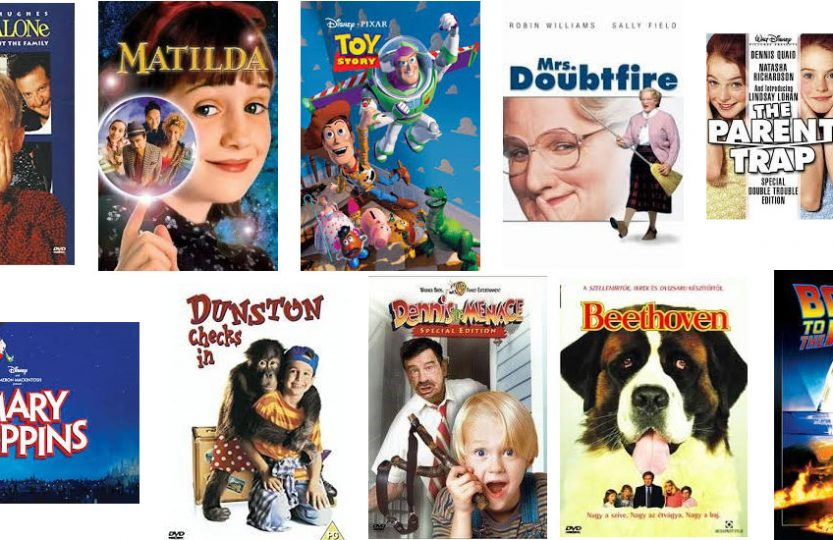

# Watching Great Movies and Uncovering Similar Movies Employing Recommendation Systems

Author: James Stipanowich

## Project Overview

Watching movies can be a lot of fun. When a person watches a movie, they often judge the movie they encounter. Often the person categorizes and scores a movie based on information from previous movies the person has watched. The opinions about movies a person has define what someone watches and might determine what someone chooses to watch in the future. What if specific information is desired on great movies to watch in the future based on a current highly enjoyed movie? How can a computer imitate the human task of identifying highly rated movies based on opinions about movies a person has watched and uncover other similar movies for a person to watch in the future? The answer is with recommendation systems. Recommendation systems input movie information from movie lovers into a computer algorithm to provide a movie lover with similar movies to watch based on the current movie opinions and information from a movie lover as well as other related sources. The recommendation systems can often take a person's love for a movie and through an algorithm find other popular, similar movies for that person to watch in the future.

## Business Problem

In this project, I am acting as a data scientist in a research lab at the University of Minnesota to build a recommendation system that recommends highly rated movies to people in the University of Minnesota area based on some past information and opinions on great movies expressed by these people. The project contains both modeling and function built-out methods for getting movie recommendations. I want to use a collaborative filtering user-based method to define movie recommendations for the people in this area. That means that the opinions of the movie raters involved in the experiment may affect the resulting recommendations for the other movie raters in the experiment. I plan to uncover 5 new movie recommendations for any person to watch involved in my experiment using my specific recommendation system algorithms for them each individually.

## The Data

This project uses data from the MovieLens dataset from the GroupLens research lab at the University of Minnesota. The MovieLens dataset can be found at https://grouplens.org/datasets/movielens/latest/. The dataset covers 100836 ratings of movies from past viewings of movies. There are 610 individual movie raters in the dataset and 9724 unique rated movies in the dataset.

I decided what data from this dataset to use and how to use it. 

## Data Preparation

In order to look at the spread of ratings in the dataset for my analyses in this project, I created a graph showing how many ratings were in my dataset and how each movie was rated accordingly within the dataset:

There were 100836 ratings of movies from past viewings of movies in the dataset. The most common movie rating was a '4' rating. However, I opted to look at the most highly rated movies (a '5' rated movie) when making most movie recommendations.

Also, I constructed a graph of the number of rated movies for each unique user in the dataset: 

There were explicit ratings from my dataset. The most number of ratings a single user provided was over 2500, which provides a lot of information for assembling recommendations in a user-based manner. Some users only provided a couple of ratings so a filling of missing values occurred in some of my recommedation systems creations to get more similarity information to provide predicted recommendations for some users.

## Data Modeling

After trying different models and code, I chose to go with two different paths to retrieving top 5 movie recommendations. The ways I decided to attain movie recommendations included a model-based method involving Singular Value Decomposition(SVD) with a K Nearest Neighbors model and the creation of a function-based, built out, non-model method to get movie recommendations just using a Euclidean distance metric for similarities and python code.

For both recommendation system methods I decided to find similar users to user 43 in the dataset who watched the movie, "Toy Story," and rated the movie a '5'. This was a highly rated film and I wanted to find similar such films through recommendation systems.

The KNN model that included SVD had a solid RMSE of .8786. The KNN model determined five similar neighbor users to user 43 who watched the movie, "Toy Story." Most of the movie recommendations from this system were movies released around the same year that had high ratings.

The function-based built out method used a Euclidean distance metric to calculate user similarities. The function took out movies that were already watched by the user to increase the chance of unique movie recommendations. The function sorted the movies to only mostly recommend movies rated a '5' to keep with the theme of recommending only highly rated movies.

## The Cold Start Problem

Both recommendation systems did well, but how do they address a common problem known as the cold start problem? The cold start problem occurs where a new user is introduced to the dataset that has not provided a substantial amount of information to make recommendations. SVD was included in the KNN model to address the cold start problem. SVD involves the creation of a sparse matrix where user ratings for movies can be inferred based off of a few provided ratings or small amount of information from a new user in relation to already provided user information. The new user can be asked to provide a small amount of information about possible interests and a new user can be categorized in accordance with similar user preferences to determine what the new user might like. Also, what is popular or trending can be a recommendation created for a new user. The KNN model mainly recommended highly rated movies around the same year that "Toy Story" was released, so what was popular in the year "Toy Story" was released was usually recommended to deal with the cold start problem. For the function-based recommendation system unrated movies were filled in with the mean rating for each column in the user ratings dataframe. A collaborative filtering user-based method was instilled. Movies that were already watched were left out of recommendations for a user. Movies that were recommended to users and considered popular were movies that were estimated to be highly rated by lots of users.

## Conclusions

- Five similar movies to "Toy Story" from the neighboring users in the KNN model with ratings were: 

Men in Black (a.k.a. MIB) (1997)/5.0,
Forrest Gump (1994)/5.0,
Star Wars: Episode IV - A New Hope (1977)/5.0,
Pinocchio (1940)/4.5,
and Mrs. Doubtfire (1993)/3.5

- Five similar movies to "Toy Story" from the function-based, built out recommendation system with ratings were:                                       
     
SORI: Voice from the Heart (2016)/5.0,
Rivers and Tides (2001)/5.0,
Presto (2008)/5.0,
All the Vermeers in New York (1990)/5.0,
and My Left Eye Sees Ghosts (Ngo joh aan gin diy g.../5.0

## Recommendations for Further Analysis

- Consider an item-item based collaborative filtering method for getting recommendations

- Change the distance metric and parameters for my function-based recommendation system

- Deploy a recommendation system for use to new users

## For More Information

See the full analysis of my findings in Recommendations.ipynb

Contact me at jmstipanowich@gmail.com

## Repository Structure

├── images

├── README.md

├── RecommendationSystems1.pdf

├── Recommendations.ipynb
